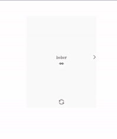
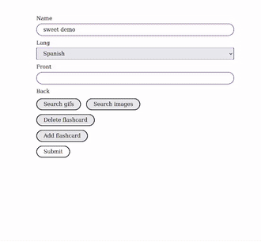
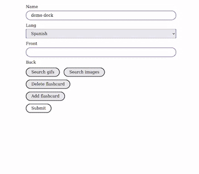
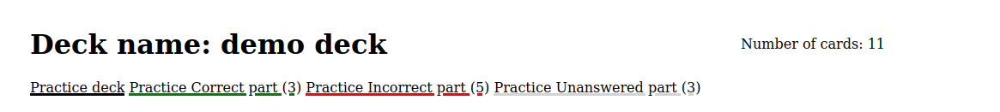

# Welcome to Immersive Flashcards 🚀

**Frustrated with boring memorization techniques?**  
This app revolutionizes language learning by letting you **create vivid mental associations** using GIFs, images, and real-world contexts—no more dull translations!

---

## 🔥 Key Features

### 1. Words in Context

  
See your target word in **real-life sentences**—like watching a movie clip!

_Supercharge your learning:_

- Many sentences include **native speaker audio** (click the 🔊 icon)
- Reinforce pronunciation while absorbing natural flow
- _Not all examples have audio!_

### 2. Visual Vocabulary

  
Find the perfect image to anchor the word in your mind.

### 3. Animated Learning

  
GIFs make abstract words _click_ (e.g., "to run" = �️ Usain Bolt sprinting).

---

## 🎯 Smart Practice Modes

**Missed some cards?** We get it—life happens. That's why you can:

- **Focus on your weak spots** → Practice _only_ the cards you got wrong last time
- **Polish your wins** → Replay correctly answered cards to lock them in
- **Fresh challenges** → Filter for untouched cards when you want new material

_Like having a personal coach who knows exactly where you need work._

---

## ✨ Why It Works

- **Your brain is wired for visuals** - We use GIFs and images that exploit your natural ability to remember vivid content far better than plain text
- **Vocabulary comes alive** - Words transform into memorable moments when paired with perfectly matched visuals (no more boring word lists)
- **Learn without trying** - The right visual association makes words stick automatically, like how you remember scenes from favorite movies

---

## 🛠️ Tech Stack

- **Symfony 7**

---

## 🌍 Supported Languages

- 🇬🇧 English
- 🇮🇹 Italian
- 🇩🇪 German
- 🇷🇺 Russian
- 🇪🇸 Spanish
- 🇫🇷 French

---

## 🚀 Try It Yourself!

Ready to supercharge your vocabulary? **[Visit the app now!](https://immersive-flashcards.tech)**
